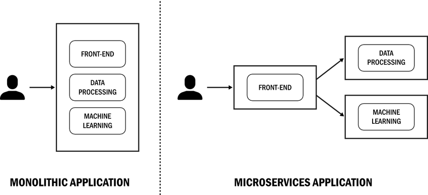

{ align=right width="130"}

# Frontend

---

!!! danger
    Module is still under development

If you have gone over the [deployment module](../s7_deployment/README.md) you should be at the point where you have a
machine learning model running in the cloud. The model can be interacted with by sending HTTP requests to the API
endpoint. In general we refer to this as the *backend* of the application. It is the part of our application that are
behind-the-scences that the user does not see and it is not really that user-friendly. Instead we want to create a
*frontend* that the user can interact with in a more user-friendly way. This is what we will be doing in this module.

Another point of splitting our application into a frontend and a backend has to do with scalability. If we have a lot
of users interacting with our application, we might want to scale only the backend and not the frontend, because that
is the part that will be running our heavy machine learning model. In general dividing a application into smaller pieces
are the pattern that is used in microservice architectures.

<figure markdown>
{ width="800" }
<figcaption>
In monollithic applications everything the user may be requesting of our application is handled by a single process/
container. In microservice architectures the application is split into smaller pieces that can be scaled independently.
This also leads to easier maintainability and faster development.
<a
href="https://www.researchgate.net/figure/Comparison-between-monolithic-and-microservices-architectures-for-an-application-that_fig5_355361563">
Image Credit.
</a>
</figcaption>
</figure>

Frontends have for the longest time been created using HTML, CSS and JavaScript. This is still the case, but there are
now a lot of frameworks that can help us create a frontend in Python:

* [Django](https://www.djangoproject.com/)
* [Reflex](https://reflex.dev/)
* [Streamlit](https://streamlit.io/)
* [Bokeh](http://bokeh.org/)
* [Gradio](https://www.gradio.app/)

In this module we will be looking at `streamlit`. `streamlit` is a easy to use framework that allows us to create
interactive web applications in Python. It is not at all as powerful as a framework like `Django`, but it is very easy
to get started with and it is very easy to integrate with our machine learning models.

### ❔ Exercises

In these exercises we go through the process of up a backend using `fastapi` and a frontend using `streamlit`,
containerizing both applications and then deploying them to the cloud. We have already created an example of this
which can be found in the `samples/frontend_backend` folder.

1. Start by installing `streamlit`

    ```bash
    pip install streamlit
    ```

    and run `streamlit hello` afterwards to check that everything works as expected.

2. Lets start by creating the frontend application in a `frontend.py` file. You can use essentially any frontend you
    want, but we will be using a simple streamlit application that we have created in the 
    `samples/frontend_backend/frontend`.

    You can find help in the [streamlit documentation](https://docs.streamlit.io/library/api-reference)


2. Lets start by creating the backend application in a `backend.py` file. You can use essentially any backend you want,
    but we will be using a simple imagenet classifier that we have created in the `samples/frontend_backend/backend`
    folder.

3. Containerize the backend into a file called `backend.dockerfile`.

4. Next lets write the fontend application in streamlit
