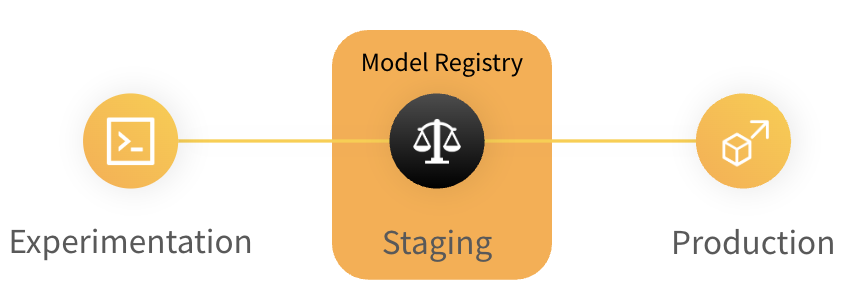
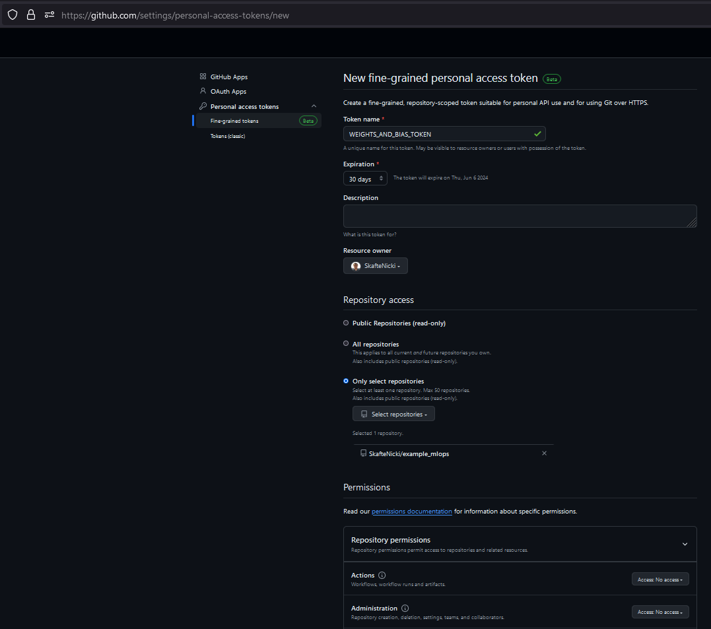
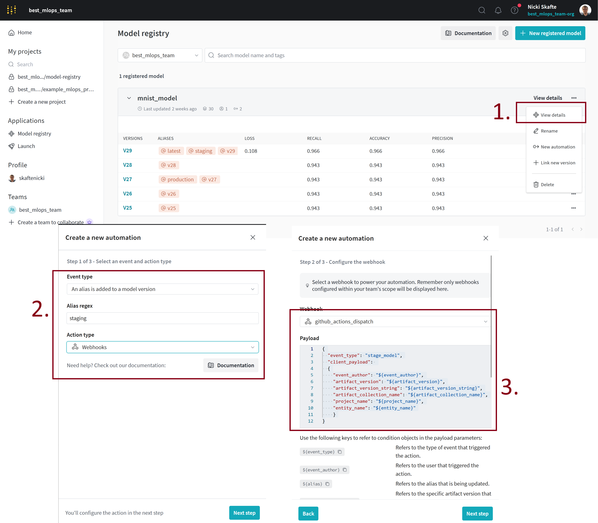

{ align=right width="130"}

# Continuous Machine Learning

---

The continuous integration we have looked at until now is what we can consider "classical" continuous integration, that
have its roots in DevOps and not MLOps. While the test that we have written and the containers ww have developed in the
previous session have be around machine learning, everything we have done translate to completely to how it would be
done if we had developed any other application did not include machine learning.

In this session, we are now gonna change gear and look at **continuous machine learning** (CML). As the name may suggest
we are now focusing on automatizing actual machine learning processes. You may ask why we need continuous integration
principals baked into machine learning pipelines? The reason is the same as with any continuous integration, namely that
we have a bunch of checks that we want our newly trained model to pass before we trust it. Writing `unittests` secures
that our code is not broken, but other failure modes of a machine learning pipeline should be checked before the model
is ready for deployment:

* Did I train on the correct data?
* Did my model converge at all?
* Did it reach a certain threshold at all?

## MLOps maturity model

Before getting started with the exercises, let's first take a look at the MLOps maturity model that will help us clarify
what we are aiming for. The maturity model is a way of understanding how mature an organization is in terms of their
machine learning operations. The model is divided into five stages:

<figure markdown>
{ width="1000" }
<figcaption>
<a href="https://learn.microsoft.com/en-us/azure/architecture/ai-ml/guide/mlops-maturity-model"> Image credit </a>
</figcaption>
</figure>


## ❔ Exercises

In the following exercises, we are going to look at two different cases where we can use continuous machine learning.
The first one is a simple case where we are automatically going to trigger the training of a model whenever we make
changes to our data. This is a very common use case in machine learning where we have a data pipeline that is
continuously updating our data. The second case is connected to staging and deploying models. In this case, we are going
to look at how we can automatically do further processing of our model whenever we push a new model to our repository.

1. For the first set of exercises, we are going to rely on the `cml` framework by [iterative.ai](https://iterative.ai/),
    which is a framework that is built on top of GitHub actions. The figure below describes the overall process using
    the `cml` framework. It should be clear that it is the very same process that we go through as in the other
    continuous integration sessions: `push code` -> `trigger GitHub actions` -> `do stuff`. The new part in this session
    that we are only going to trigger whenever data changes.

    <figure markdown>
    { width="1000" }
    <figcaption>
    <a href="https://towardsdatascience.com/continuous-machine-learning-e1ffb847b8da"> Image credit </a>
    </figcaption>
    </figure>

    1. If you have not already created a dataset class for the corrupted Mnist data, start by doing that. Essentially,
        it is a class that should inherit from `torch.utils.data.Dataset` and should have a `__getitem__` and `__len__`

        ??? success "Solution"

            ```python linenums="1" title="dataset.py"
            --8<-- "s5_continuous_integration/exercise_files/dataset.py"
            ```

    2. Then lets create a function that can report basic statistics such as the number of training samples, number of
        test samples, a distribution of the classes in the dataset. This function should be called `calculate`
        and should take the dataset as input.

        ??? success "Solution"

            ```python linenums="1" title="dataset.py"
            --8<-- "s5_continuous_integration/exercise_files/dataset_statistics.py"
            ```

    3. Next, we are going to implement a Github actions workflow that only activates when we make changes to our data.
        Create a new workflow file (call it `cml_data.yaml`) and make sure it only activates on push/pull-request events
        when `data/` changes. Relevant
        [documentation](https://docs.github.com/en/actions/using-workflows/workflow-syntax-for-github-actions#onpushpull_requestpull_request_targetpathspaths-ignore)

        ??? success "Solution"

            The secret is to use the `paths` keyword in the workflow file. We here specify that the workflow should only
            trigger when the `.dvc` folder or any file with the `.dvc` extension changes, which is the case when we
            update our data and call `dvc add data/`.

            ```yaml

            name: DVC Workflow

            on:
            push:
                branches:
                - main
                paths:
                - '**/*.dvc'
                - '.dvc/**'
            pull_request:
                branches:
                - main
                paths:
                - '**/*.dvc'
                - '.dvc/**'
            ```

    4. The next step is to implement steps in our workflow that does something when data changes. This is the reason
        why we created the `dataset_statistics` function. Implement a workflow that:

        1. Checks out the code
        2. Setups Python
        3. Installs dependencies
        4. Runs the `dataset_statistics` function

        ??? success "Solution"

            ```yaml
            jobs:
              dataset_statistics:
                runs-on: ubuntu-latest
                steps:
                - name: Checkout code
                  uses: actions/checkout@v4

                - name: Set up Python
                  uses: actions/setup-python@v5
                  with:
                    python-version: 3.11
                    cache: 'pip'
                    cache-dependency-path: setup.py

                - name: Install dependencies
                  run: |
                    pip install -r requirements.txt
                    pip list

                - name: Download data
                  run: |
                    dvc pull data/
                    ls data/

                - name: Run dataset statistics
                  run: |
                    python dataset_statistics.py
            ```


    4. Now let's try to activate the workflow.

2. For the second set of exercises, we are going to look at how to automatically run further testing of our models
    whenever we add them to our model registry. For that reason, do not continue with this set of exercises before you
    have completed the exercises on the model registry in [this module](../s4_debugging_and_logging/logging.md).

    <figure markdown>
    { width="600" }
    <figcaption>
    The model registry is in general a repository of a team's trained models where ML practitioners publish candidates
    for production and share them with others. Figure from [wandb](https://docs.wandb.ai/guides/model_registry).
    </figure>

    1. The first step is in our weights and bias account to create a team. Some of these more advanced features are only
        available for teams, however every user is allowed to create one team for free. Go to your weights and bias
        account and create a team (the option should be on the left side of the UI). Give a team name and select W&B
        cloud storage.

    2. Now we need to generate a personal access token that can link our weights and bias account to our GitHub account.
        Go to [this page](https://github.com/settings/personal-access-tokens/new) and generate a new token. You can also
        find the page by clicking your profile icon in the upper right corner of Github and selecting
        `Settings`, then `Developer settings`, then `Personal access tokens` and finally choose either
        `Tokens (classic)` or `Fine-grained tokens` (which is the safer option, which is also what the link points to).

        <figure markdown>
        { width="500" }
        </figure>

        give it a name, set what repositories it should have access to and select the permissions you want it to have.
        In our case if you choose to create `Fine-grained token` then it needs access to the `contents:write`
        permission. If you choose `Tokens (classic)` then it needs access to the `repo` permission. After you have
        created the token, copy it and save it somewhere safe.

    3. Go to the settings of your newly created team: <https://wandb.ai/<teamname>/settings> and scroll down to the
        `Team secrets` section. Here add the token you just created as a secret with the name `GITHUB_ACTIONS_TOKEN`.
        WANDB will now be able to use this token to trigger actions in your repository.

    4. On the same settings page, scroll down to the `Webhooks` settings. Click the `New webhook` button in fill in the
        following information:

        * Name: `github_actions_dispatch`
        * URL: `https://api.github.com/repos/<owner>/<repo>/dispatches`
        * Access token: `GITHUB_ACTIONS_TOKEN`
        * Secret: leave empty

        You here need to replace `<owner>` and `<repo>` with your own information. The `/dispatches` endpoint is a
        special endpoint that all Github actions workflows can listen to. Thus, if you ever want to setup a webhook in
        some other framework that should trigger a Github action, you can use this endpoint.

    5. Next, navigate to your model registry. It should hopefully contain at least one registry with at least one model
        registered. If not, go back to the previous module and do that.

    6. When you have a model in your registry, click on the `View details` button. Then click the `New automation`
        button. On the first page, select that you want to trigger the automation when an alias is added to a model
        version, set that alias to `staging` and select the action type to be `Webhook`. On the next page, select the
        `github_actions_dispatch` webhook that you just created and add this as the payload:

        ```json
        {
            "event_type": "staged_model",
            "client_payload":
            {
                "event_author": "${event_author}",
                "artifact_version": "${artifact_version}",
                "artifact_version_string": "${artifact_version_string}",
                "artifact_collection_name": "${artifact_collection_name}",
                "project_name": "${project_name}",
                "entity_name": "${entity_name}"
            }
        }
        ```

        Finally, on the next page give the automation a name and click `Create automation`.

        <figure markdown>
        { width="500" }
        </figure>

        Make sure you understand overall what is happening here.

        ??? success "Solution"

            The automation is set up to trigger a webhook whenever the alias `staging` is added to a model version. The
            webhook is set up to trigger a Github action workflow that listens to the `/dispatches` endpoint and has
            the event type `staged_model`. The payload that is sent to the webhook contains information about the model
            that was staged.

    7. We are now ready to create the `Github actions workflow` that listens to the `/dispatches` endpoint and triggers
        whenever a model is staged. Create a new workflow file (called `stage_model.yaml`) and make sure it only
        activates on the `staged_model` event. Hint: relevant
        [documentation](https://docs.github.com/en/actions/using-workflows/events-that-trigger-workflows)

        ??? success "Solution"

            ```yaml
            name: Check staged model

            on:
              repository_dispatch:
                types: staged_model
            ```

    8. Next, we need to implement the steps in our workflow that do something when a model is staged. The payload that
        is sent to the webhook contains information about the model that was staged. Implement a workflow that:

        1. Identifies the model that was staged
        2. Sets an environment variable with the corresponding artifact path
        3. Outputs the model name

        ??? success "Solution"

            ```yaml
            jobs:
              identify_event:
                runs-on: ubuntu-latest
                outputs:
                  model_name: ${{ steps.set_output.outputs.model_name }}
                steps:
                  - name: Check event type
                    run: |
                      echo "Event type: repository_dispatch"
                      echo "Payload Data: ${{ toJson(github.event.client_payload) }}"

                  - name: Setting model environment variable and output
                    id: set_output
                    run: |
                      echo "model_name=${{ github.event.client_payload.artifact_version_string }}" >> $GITHUB_OUTPUT
            ```

    9. We now need to write a script that can be executed on our staged model. In this case, we are going to run some
        performance tests on it to check that it is fast enough for deployment. Therefore, do the following:

        1. In a `tests/performancetests` folder, create a new file called `test_model.py`

        2. Implement a test that loads the model from an wandb artifact path e.g.
            <team-name>/<project-name>/<artifact-name>:<version> and runs it on a random input. Importantly, the
            artifact path should be read from an environment variable called `MODEL_NAME`.

        3. The test should assert that the model can do 100 predictions in less than X amount of time

        ??? success "Solution"

            In this solution we assume that 4 environment variables are set: `WANDB_API`, `WANDB_ENTITY`,
            `WANDB_PROJECT` and `MODEL_NAME`.

            ```python linenums="1" title="test_model.py"
            import wandb
            import os
            import time
            from my_project.models import MyModel

            def load_model(artifact):
                api = wandb.Api(
                    api_key=os.getenv("WANDB_API_KEY"),
                    overrides={"entity": os.getenv("WANDB_ENTITY"), "project": os.getenv("WANDB_PROJECT")},
                )
                artifact = api.artifact(model_checkpoint)
                artifact.download(root=logdir)
                file_name = artifact.files()[0].name
                return MyModel.load_from_checkpoint(f"{logdir}/{file_name}")

            def test_model_speed():
                model = load_model(os.getenv("MODEL_NAME"))
                start = time.time()
                for _ in range(100):
                    model(torch.rand(1, 1, 28, 28))
                end = time.time()
                assert end - start < 1
            ```


    10. Let's now add another job that calls the script we just wrote. It needs to:

        * Setup the correct environment variables
        * Checkout the code
        * Setup Python
        * Install dependencies
        * Run the test

        which is very similar to the kind of jobs we have written before.

        ??? success "Solution"

            ```yaml
            jobs:
              identify_event:
                ...
              test_model:
                runs-on: ubuntu-latest
                needs: identify_event
                env:
                  WANDB_API_KEY: ${{ secrets.WANDB_API_KEY }}
                  WANDB_ENTITY: ${{ secrets.WANDB_ENTITY }}
                  WANDB_PROJECT: ${{ secrets.WANDB_PROJECT }}
                  MODEL_NAME: ${{ needs.identify_event.outputs.model_name }}
                steps:
                - name: Echo model name
                  run: |
                    echo "Model name: $MODEL_NAME"
                - name: Checkout code
                  uses: actions/checkout@v4

                - name: Set up Python
                  uses: actions/setup-python@v5
                  with:
                    python-version: 3.11
                    cache: 'pip'
                    cache-dependency-path: setup.py

                - name: Install dependencies
                  run: |
                    pip install -r requirements.txt
                    pip list

                - name: Test model
                  run: |
                    pytest tests/performancetests/test_model.py
            ```

    11. Finally, we are going to assume in this setup that if the model gets this far then it is ready for deployment.
        We are therefore going to add a final job that will add a new alias to the model called `production`. Here is
        some relevant Python code that can be used to add the alias:

        ```python
        import click
        import os
        import wandb

        @click.command()
        @click.argument("artifact-path")
        @click.option(
            "--aliases", "-a", multiple=True, default=["staging"], help="List of aliases to link the artifact with."
        )
        def link_model(artifact_path: str, aliases: list[str]) -> None:
            """
            Stage a specific model to the model registry.

            Args:
                artifact_path: Path to the artifact to stage.
                    Should be of the format "entity/project/artifact_name:version".
                aliases: List of aliases to link the artifact with.

            Example:
                model_management link-model entity/project/artifact_name:version -a staging -a best

            """
            if artifact_path == "":
                click.echo("No artifact path provided. Exiting.")
                return

            api = wandb.Api(
                api_key=os.getenv("WANDB_API_KEY"),
                overrides={"entity": os.getenv("WANDB_ENTITY"), "project": os.getenv("WANDB_PROJECT")},
            )
            _, _, artifact_name_version = artifact_path.split("/")
            artifact_name, _ = artifact_name_version.split(":")

            artifact = api.artifact(artifact_path)
            artifact.link(target_path=f"{os.getenv('WANDB_ENTITY')}/model-registry/{artifact_name}", aliases=aliases)
            artifact.save()
            click.echo(f"Artifact {artifact_path} linked to {aliases}")
        ```

        for example, you can run this script with the following command:

        ```bash
        python link_model.py entity/project/artifact_name:version -a staging -a production
        ```

        Implement a final job that calls this script and adds the `production` alias to the model.

        ??? success "Solution"

            ```yaml
            jobs:
              identify_event:
                ...
              test_model:
                ...
              add_production_alias:
                runs-on: ubuntu-latest
                needs: identify_event
                env:
                  WANDB_API_KEY: ${{ secrets.WANDB_API_KEY }}
                  WANDB_ENTITY: ${{ secrets.WANDB_ENTITY }}
                  WANDB_PROJECT: ${{ secrets.WANDB_PROJECT }}
                  MODEL_NAME: ${{ needs.identify_event.outputs.model_name }}
                steps:
                - name: Echo model name
                  run: |
                    echo "Model name: $MODEL_NAME"

                - name: Checkout code
                  uses: actions/checkout@v4

                - name: Set up Python
                  uses: actions/setup-python@v5
                  with:
                    python-version: 3.11
                    cache: 'pip'
                    cache-dependency-path: setup.py

                - name: Install dependencies
                  run: |
                    pip install -r requirements.txt
                    pip list

                - name: Add production alias
                  run: |
                    python link_model.py $MODEL_NAME -a production
            ```

    12. Finally, make sure the workflow works as expected. To try it out again and again for testing purposes, you can
        just manually add and then delete the `staging` alias to any model version in the model registry.

    13. (Optional) Consider adding more checks to the workflow. For example, you could add a step that checks if the
        model is too large for deployment, runs some further evaluation scripts, or checks if the model is robust to
        adversarial attacks. Only the imagination sets the limits here.

### 🧠 Knowledge check
